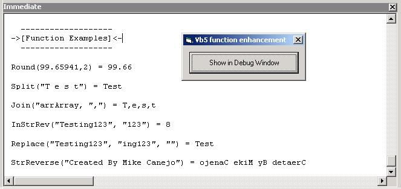



## VB5 Round\(\), Split\(\), Join\(\), Replace\(\), InStrRev\(\), StrReverse\(\)

### Description

This gives vb5 the functionality of the 6 main vb6 built-in functions which vb5 doesn't support. I wrote these a couple years ago for a friend using vb5, and although there were many at psc, I disliked them. The functions are as close to the original as I could get them, enjoy. [update: Added Round(Number,NumDigitsAfterDecimal) function to the module also included demonstration examples for each function! (screenshot), enjoy!]
 
### More Info
 

             |
---                |---
**Submitted On**   |2003-04-20 22:54:16
**By**             |[Michael L\. Canejo](https://github.com/Planet-Source-Code/PSCIndex/blob/master/ByAuthor/michael-l-canejo.md)
**Level**          |Intermediate
**User Rating**    |4.7 (14 globes from 3 users)
**Compatibility**  |VB 4\.0 \(16\-bit\), VB 4\.0 \(32\-bit\), VB 5\.0
**Category**       |[VB function enhancement](https://github.com/Planet-Source-Code/PSCIndex/blob/master/ByCategory/vb-function-enhancement__1-25.md)
**World**          |[Visual Basic](https://github.com/Planet-Source-Code/PSCIndex/blob/master/ByWorld/visual-basic.md)
**Archive File**   |[VB5\_Round\(1578134222003\.zip](https://github.com/Planet-Source-Code/michael-l-canejo-vb5-round-split-join-replace-instrrev-strreverse__1-44830/archive/master.zip)

